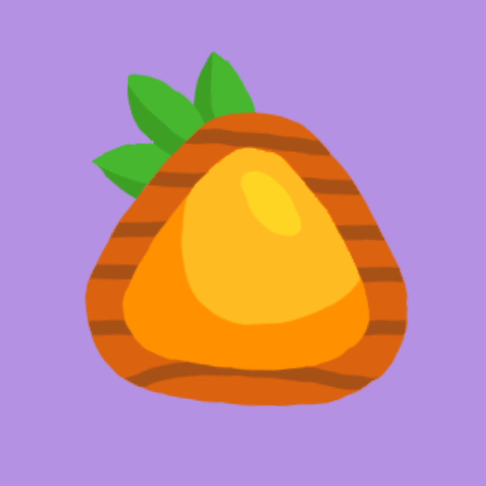

<a name="readme-top"></a>
```sh
   Thanadon Boontawee - 6410685165 - AS1
```
<!-- PROJECT LOGO -->
<br />
<div align="center">
  <a href="https://github.com/fusethnd/repo_name">
    
  </a>

<h3 align="center">Number Guessing Game</h3>

  <p align="center">
    Game application for guess number
    <br>
    <br />
    <a href="https://youtu.be/KYvBBvi9v8o">📲 Demo Video </a>
    ·
    <a href="https://github.com/fusethnd/NumberGuessing">📥 Repository </a>
    ·
    <a href="https://github.com/fusethnd/NumberGuessing/issues">👾 Report Bug </a>
  </p>
</div>

<br>


<!-- TABLE OF CONTENTS -->
<details>
  <summary>Table of Contents</summary>
  <ol>
    <li>
      <a href="#about-the-project">About The Project</a>
    </li>
    <li>
      <a href="#features">Features</a>
    </li>
    <li>
      <a href="#getting-started">Getting Started</a>
    </li>
    <li><a href="#how-to-play">How to Play</a></li>
    <li><a href="#contact">Contact</a></li>
  </ol>
</details>


<!-- ABOUT THE PROJECT -->
## About The Project

[![Product Name Screen Shot][product-screenshot]](https://example.com)

This project is a Swift-based game where players can engage in a number guessing challenge. The game allows the player to choose a custom range of numbers to guess, providing an interactive and customizable experience.


### Built With
[![Swift][Swift]][Swift-url]

<!-- FEATURES -->
## Features

- **Custom Range Selection:** Players can set a specific range of numbers within which they want to guess (Maximum for guess is 1000).

- **Guess Feedback:** After making a guess, the game provides feedback via alerts, indicating whether the guessed number is greater or less than the target number.

- **Round Tracking:** The game keeps track of the rounds played before the player correctly guesses the number. This information is displayed upon a successful guess.

- **Restart Functionality:** The game offers the option to restart, allowing players restart game and random a new number if the players doesn't want to enjoy this game anymore.

<!-- GETTING STARTED -->
## Getting Started

To run the project locally, follow these steps:

1. Clone the repository:

   ```bash
   git clone https://github.com/fusethnd/NumberGuessing.git
   ```

2. Open the Xcode project in the cloned repository.

3. Build and run the project on a simulator or a physical iOS device.

4. Enjoy playing the Number Guessing Game!


<!-- USAGE EXAMPLES -->
## How to Play
1. **Set Custom Range:**
   - Launch the game and choose a custom range of numbers for the guessing game. For example, you can select a range between 15 to 40. Once the range is set, start the game.

2. **Make a Guess:**
   - Enter your guess within the chosen range.

3. **Receive Feedback:**
   - After each guess, an alert will inform you whether the correct number is greater or less than your guess.

4. **Correct Guess:**
   - Upon correctly guessing the number, the game will display the rounds played before the correct guess.

5. **Restart the Game:**
   - Choose to restart the game for restart new game.

<!-- CONTACT -->
## Contact
Thanadon Boontawee - [@fusethnd](https://github.com/fusethnd) - [fusethnd\@gmail.com](mailto:fusethnd@gmail.com?subject=Test)

<br>

Here are some [🦜 party parrots](https://cultofthepartyparrot.com):

<div>
    
    
    
    
    
    
    
    
    
    
    
    
    
    
    
    
    
    
    
    
    
    
    
    
</div>

<!-- MARKDOWN LINKS & IMAGES -->
<!-- https://www.markdownguide.org/basic-syntax/#reference-style-links -->
[Swift]: https://img.shields.io/badge/Swift-FA7343?style=for-the-badge&logo=swift&logoColor=white
[Swift-url]: https://www.swift.org/
